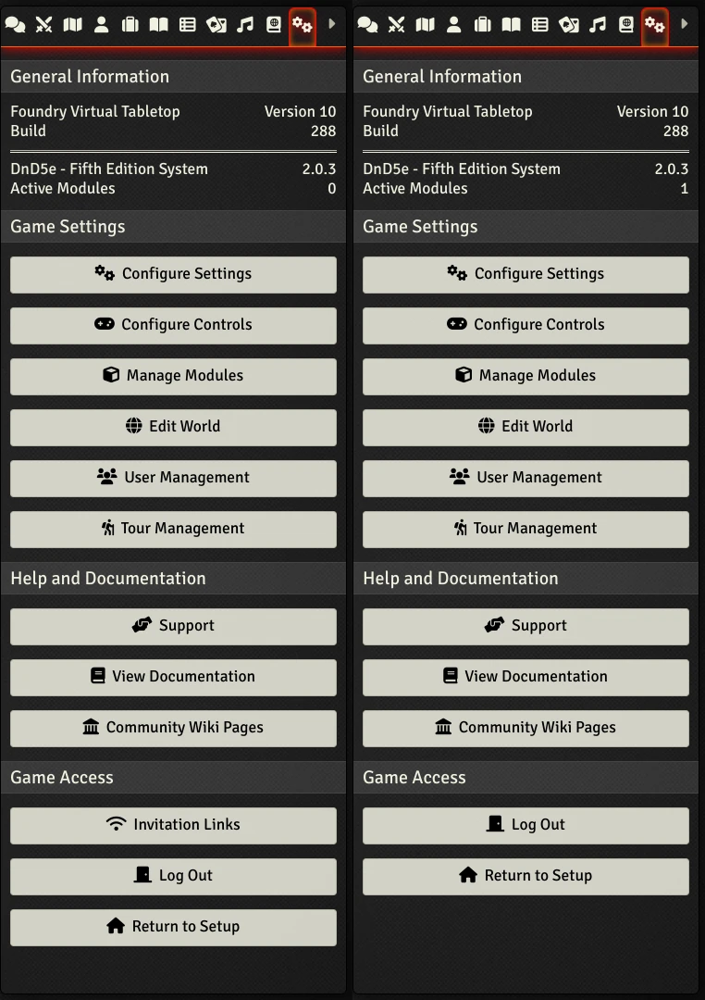

# Remove Invitation Links Button

A simple module to remove the **Invitation Links** button from the **Game Settings** sidebar tab.

## Installation

**Method 1:**

* Start Foundry and head to the Add-on Modules tab.
* Click **Install Module**.
* Search for **Remove Invitation Links Button**.
* Click the **Install** button when it comes up.

**Method 2:**

* Start Foundry and head to the Add-on Modules tab.
* Click **Install Module**.
* Paste the following link into the **Manifest URL** field at the bottom:
  <https://github.com/marcstraube/foundryvtt-remove-invitation-links-button/releases/latest/download/module.json>
* Click **Install**.
